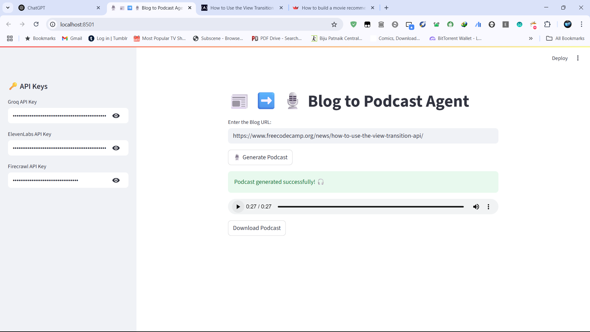

# 🎙️ BlogToPodcast-Agent

Turn blogs into bite-sized **audio podcasts** using the power of **Groq**, **Firecrawl**, **ElevenLabs**, and the **Agno Agent Framework** — all wrapped in an elegant **Streamlit web app**.



---

## 🚀 Features

- 🔗 **Input any blog URL**
- 🧠 **Scrapes content** using `Firecrawl`
- ✍️ **Summarizes** to under 2000 characters using `Groq (LLaMA 3-70B)`
- 🎤 **Converts text to podcast audio** using `ElevenLabs`
- 💾 Download the podcast as `.wav` directly from the app
- ⚙️ Clean UI powered by `Streamlit`

---

## 🧰 Tech Stack

| Tech           | Purpose                                |
|----------------|----------------------------------------|
| [Groq](https://groq.com)              | LLM for summarizing blog content          |
| [Firecrawl](https://firecrawl.dev)   | Web scraping blog content                 |
| [ElevenLabs](https://www.elevenlabs.io/) | Text-to-speech audio generation           |
| [Agno](https://pypi.org/project/agno/) | Agent orchestration framework             |
| [Streamlit](https://streamlit.io)     | Frontend web interface                    |

---

## 🖥️ Demo

Paste your blog link, and with one click – get a smooth audio podcast version of the content.

> Ideal for busy readers who prefer listening over reading.

---

## 🔑 Setup Instructions

### 1. Clone the Repo

```bash
git clone https://github.com/Electrolight123/BlogToPodcast-Agent.git
cd BlogToPodcast-Agent
```

### 2. Install Dependencies

```bash
pip install uv
uv init
uv add requirements.txt
```

> `uv` is used for faster and more secure dependency management. You can also use `pip` normally if preferred.

### 3. Run the App

```bash
streamlit run main.py
```

---

## 🔐 API Keys Required

Set the following API keys in the sidebar of the Streamlit UI:

- `GROQ_API_KEY` – for LLM summarization
- `ELEVEN_LABS_API_KEY` – for text-to-speech
- `FIRECRAWL_API_KEY` – for blog scraping

> Don't have them yet? Sign up:
> - [Groq](https://console.groq.com/)
> - [ElevenLabs](https://www.elevenlabs.io/)
> - [Firecrawl](https://firecrawl.dev)

---

## 📁 File Structure

```
├── assets/
│   └── Screenshot.png
├── audio_generations/
│   └── (generated podcast files)
├── main.py
├── requirements.txt
└── README.md
```

---

## ✨ Sample Output

Once processed, you'll hear a clear audio summary like this:

> _"In today’s blog, we explore how generative AI is transforming the podcasting industry..."_

---

## 💬 Contributing

Feel free to fork and open PRs for improvements or bug fixes.

---

## 📜 License

MIT License © 2025 [Abhishek bala]

---

## ⭐️ Show some love

If you like the project, give it a ⭐ and share it! Feedback and suggestions are welcome.

